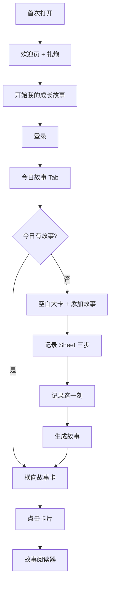

# 学生端 UI/UE 设计文档（V1 修正版）

> **版本**：2.0（方向修正）  
> **日期**：2026-06-01  
> **受众**：14–22 岁学生  
> **产品定位**：温暖陪伴型成长伙伴 App  
> **情感关键词**：像冬天晒太阳 — 舒服、轻松、治愈、被接纳、温暖  
> **技术栈**：Flutter 3.x + FastAPI（接口见 `flutter_v1_1_contract.md`）  
> **原则**：学生端只展示与轻量输入；规则、Prompt、LLM 在服务端 Story Engine 完成。

---

## 0. 设计方向声明（必读）

### 0.1 我们不做什么

本产品 **不是** Daylio 式「记录 → 统计 → 回顾」工具，也 **不是** 教育管理系统或数据分析产品。

避免：

- 任务系统感、打卡压迫感  
- 首屏「今天过得怎么样？」式效率提问  
- 情绪优先的记录路径  
- 折线图、分析图、粒子爆炸、弹簧翻转等重动效  

### 0.2 我们要做什么

```text
进入 App
    ↓
感受到陪伴（成长伙伴）
    ↓
记录今天（发生了什么）
    ↓
获得温柔反馈（故事 + 小人）
    ↓
形成成长故事（今日故事卡片）
```

**四条设计原则**

| 顺序 | 原则 |
|------|------|
| 1 | **先故事，后记录** — 首页是今日故事，不是录入表单 |
| 2 | **先陪伴，后分析** — 成长伙伴在场，不做冷冰冰仪表盘 |
| 3 | **先温暖，后功能** — 文案与动效服务于安全感 |
| 4 | **先事件，后情绪** — 记录问「发生了什么」，再问心情 |

---

## 1. 产品边界与后端映射

### 1.1 角色

| 角色 | 端 | 行为 |
|------|-----|------|
| 教师/德育 | 管理端（非本文） | 观察录入、`POST /record` |
| 学生 14–22 | **Flutter 学生端** | 陪伴首页、轻记录、读故事、看今日状态 |
| Story Engine | 后端 | 规则、模板、LLM、故事与 `visual_payload` |

### 1.2 用户心智

用户应形成：

```text
「这是我的成长伙伴」
```

而不是：

```text
「这是一个记录工具」
```

### 1.3 字段映射（UI 顺序 ≠ API 字段顺序）

| 记录步骤 | 学生端展示 | API 字段 | 说明 |
|----------|------------|----------|------|
| ① 发生了什么 | 事件类型六选一 | `event_type` | 映射故事类目（友谊/学习等） |
| ② 心情 | 表情五选一 | `emotion_tag` | 提交用英文 tag，展示用中文 |
| ③ 一句话 | 最多 50 字 | `event_content` | V1 主文案；可同步写入 `event_title` 前 20 字或规则生成标题 |
| — | 故事小人 | `visual_payload.companion_scene` | 前端约定扩展，见契约 |
| — | 故事卡片 | `Story.title` / `body` / `emotion_flow` | 生成后展示 |

**内容安全**（与 Story Prompt 一致）：不出现评价、建议、诊断；生成态文案为「正在为你写今天的故事…」。

---

## 2. 成长伙伴（产品灵魂）

### 2.1 角色设定

- **默认名**：小星（可 V1.2 支持改名）  
- **气质**：安静、温暖、不催促；像一起晒太阳的朋友  
- **出现位置**：首页顶部区、欢迎页、故事卡片角标、记录成功反馈  

### 2.2 首页伙伴状态

| 状态 | 视觉 | 动画（Gentle Motion） |
|------|------|------------------------|
| 默认 | 晒太阳 / 坐在草地上 | 呼吸（周期 3–4s） |
| 欢迎回来 | 轻微挥手可选 V1.2 | 仅呼吸 + 眨眼 |
| 记录成功 | 微笑、靠近卡片 | 漂浮 ±4px，2.5s 循环 |

**禁止**：蹦跳、大幅缩放、粒子爆炸。

### 2.3 故事小人（每故事一枚）

每个「今日故事」卡片右下角展示 **故事小人** — 由 `event_type` + 生成结果驱动，非通用 emoji。

| 故事类目（由 event_type 映射） | 小人场景示例 |
|-------------------------------|--------------|
| 友谊故事 | 小星和朋友坐在草地上 |
| 运动故事 | 小星举着奖牌 |
| 家庭故事 | 小星和家人吃饭 |
| 学习故事 | 小星坐在书桌前 |
| 兴趣故事 | 小星拿着画笔 |
| 其它 | 小星望向星空 |

**数据来源优先级**

1. `Story.visual_payload.companion_scene`（后端/文生图后续写入）  
2. 前端 `CompanionSceneCatalog` 按 `event_type` 回退占位插画  

---

## 3. 信息架构（V1：3 Tab）

```text
┌────────────────────────────────┐
│  📖 今日故事  │  🌱 今日状态  │  ☰ 更多  │
└────────────────────────────────┘
```

| Tab | 路由 | 职责 |
|-----|------|------|
| **今日故事** | `/today` | **首页**：伙伴 + 动态文案 + 今日故事卡片区（主体） |
| **今日状态** | `/status` | 今天记了什么 + 心情胶囊占比（无图表） |
| **更多** | `/more` | 账号、主题、隐私、关于伙伴、退出 |

**V1 不包含**：独立时间线 Tab、画廊 Tab、统计页。（历史故事可从「今日故事」横向滑动或 V1.2 周回顾进入。）

---

## 4. 首次打开：欢迎 → 登录

### 4.1 原则

第一次打开 **不出现** 登录/注册/手机号作为主界面 — 先建立情感，再要账号。

### 4.2 欢迎页

**背景**：暖色渐变 `#FFF4E8` → `#FFE7D1`

**中间**：成长伙伴小星 — 轻微漂浮（±6px，3s，`Curves.easeInOut`）

**文案**

```text
欢迎来到成长小岛

这里会记录你的每一次成长
```

**进入动效**：小礼炮 — 纸片缓慢飘落 1.5s（非游戏爆炸）；`opacity` + 轻微 `translateY`，10–15 片即可。

**主按钮**（胶囊 Primary）：`开始我的成长故事` → 进入登录/注册流程。

### 4.3 登录页

- 延续暖色底，顶部保留小星半身（呼吸动画）  
- 表单极简：账号 + 密码（或学校统一 SSO V1.2）  
- 主按钮：`继续`；次按钮：`稍后再说` 仅开发/审核用，生产可隐藏  

---

## 5. 今日故事（首页）

首页 **不是记录页**，是 **今日故事页**。

### 5.1 布局（自上而下）

```
┌─────────────────────────────┐
│ 6月1日 星期一                    │  顶栏：日期
├─────────────────────────────┤
│      [ 小星 · 晒太阳 ]          │  伙伴区（约 25% 屏高）
├─────────────────────────────┤
│ 欢迎回来                        │  动态文案（随机池）
│ 今天发生什么故事了吗？              │
├─────────────────────────────┤
│ ┌─────────────────────────┐ │
│ │     今日故事卡片区          │ │  主体 ≥60% 可视区
│ │   （横向 Story 带）        │ │
│ └─────────────────────────┘ │
└─────────────────────────────┘
```

### 5.2 动态文案池（随机，避免记录工具口吻）

- 欢迎回来  
- 今天也辛苦啦  
- 来留下一点成长吧  
- 你的故事值得被记住  
- 今天有什么想记录的吗  
- 今天发生什么故事了吗？  

**禁止**作为主文案：「今天过得怎么样？」「请完成今日记录」。

### 5.3 今日故事卡片区（首页核心）

**形态**：横向 `PageView` / `ListView`，类 Instagram Story **但更柔和**（大圆角 20、弱阴影、无硬边环）。

#### 空状态（今日尚无故事）

单张大卡占区域宽度 85%+：

```text
┌──────────────────────────┐
│                          │
│   今天还是空白的一页        │
│                          │
│   记录一个瞬间吧            │
│                          │
│   [ + 添加故事 ]           │
│                          │
└──────────────────────────┘
```

- `+ 添加故事`：Secondary 描边或浅色填充胶囊，非 FAB 抢戏。  

#### 有故事后（可多卡）

```text
┌──────────────────────────┐
│ 📚 友谊故事                 │
│ 今天和同学一起完成了活动…    │
│ 🙂 开心                    │
│              [故事小人]   │
└──────────────────────────┘
```

- 类目标签：友谊 / 学习 / 运动 / 家庭 / 兴趣 / 其它（由 `event_type` 映射）  
- 摘要：`body` 或 `event_content` 前两行  
- 心情：单一表情 + 中文（非图表）  
- 右下：故事小人  
- 点击整卡 → **故事阅读器**（`/story/:id`）  

**数据**：`GET /api/v1/story/daily?student_id=`；若仅有 record 未生成 story，显示「正在酝酿」轻占位或引导再记一笔（不显示失败红字）。

### 5.4 首页无情绪环、无 FAB

录入只通过卡片内或底部的 **`+ 添加故事`** 进入记录 Sheet。

---

## 6. 记录流程（事件优先）

触发：`+ 添加故事` → 底部 Sheet（圆角顶 24，可拖拽）。

### 6.1 三步（顺序固定）

**第一步 — 发生了什么？（事件）**

```text
📚 学习    👫 朋友    🏃 运动
🏠 家庭    🎨 兴趣    ✨ 其它
```

网格 2×3，每项 88×88 触控区，选中 `primaryContainer` 底。

**第二步 — 此刻心情**

```text
😄 开心   😊 平静   🤔 思考   😔 难过   😡 生气
```

横向排列，单选。

**第三步 — 一句话**

- 占位：`今天发生了什么？`  
- **最多 50 字**，字数环柔和色（接近上限才变橙，勿变红恐吓）  

**底栏固定 Primary**：`记录这一刻`

### 6.2 提交与反馈

1. `POST /api/v1/record`（字段顺序见 §1.3）  
2. Sheet 关闭 → 首页伙伴轻点头/眨眼（可选）  
3. Toast 级文案：「好的，这一刻留住了」  
4. 自动或轻提示 `POST /api/v1/story/generate`（V1 建议自动，减少一步决策）  
5. 生成中：故事卡片区骨架 + 「正在为你写今天的故事…」  
6. 成功：新卡 **Fade In 250ms** 插入横向列表；展示故事小人与温柔摘要  

**禁止**：保存后弹出冰冷「提交成功」或强制评分式反馈。

---

## 7. 今日状态页

**不要**：折线图、分析图、周/月统计、情绪曲线图。

**只要**：

### 7.1 今天的故事列表

```text
友谊故事
学习故事
运动故事
```

- 纵向柔和列表，每项左色条 + 类目 + 时间  
- 数据：当日 `timeline` 过滤或 `story/daily` + 未生成 story 的 record  

### 7.2 今日心情占比（胶囊）

```text
😄 开心  60%
😊 平静  30%
🤔 思考  10%
```

- 横向胶囊条，宽度按比例；**无坐标轴、无折线**  
- 由当日所有 `emotion_tag` 计数聚合  

### 7.3 空状态

「今天还没有留下故事」+ 文字链「去添加故事」→ 切 Tab 并打开 Sheet。

---

## 8. 故事阅读器

- 顶：暖色渐变 + `scene_prompt` 一行（字幕感，非技术）  
- 标题 `title`  
- 正文 `body`（分段、行高 1.6）  
- `sections` 可折叠，默认展开第一段  
- `emotion_flow`：V1 **用文字标签串联**，不用图表化「情绪流」组件  
- 底：Ghost「返回今日故事」；V1.2「分享」  

**不出现**：AI、模型、生成、分析 等词。

---

## 9. 更多页

- 头像、昵称  
- 成长伙伴：查看小星、改名（V1.2）  
- 外观：跟随系统 / 暖色浅 / 暖色深  
- 隐私与说明（谁可见、故事如何产生 — 同伴语气）  
- 退出登录  

---

## 10. 视觉设计语言

### 10.1 色彩

| Token | 值 | 用途 |
|-------|-----|------|
| `warmBgStart` | `#FFF4E8` | 页面渐变顶 |
| `warmBgEnd` | `#FFE7D1` | 页面渐变底 |
| `primary` | `#E8A87C` | 主按钮（暖杏，非冷紫） |
| `primaryDark` | `#C97B5A` | 按下态 |
| `primaryContainer` | `#FFF0E6` | 选中芯片底 |
| `surface` | `#FFFBF7` | 卡片底 |
| `textPrimary` | `#3D3229` | 标题（暖棕黑） |
| `textSecondary` | `#8C7B6B` | 辅助 |
| `storyFriendship` | `#B8D4E8` | 友谊故事色条 |
| `storyStudy` | `#D4C4F0` | 学习 |
| `storySport` | `#A8E6CF` | 运动 |
| `storyFamily` | `#FFD4B8` | 家庭 |
| `storyHobby` | `#F9C8D9` | 兴趣 |

### 10.2 字体与圆角

- 中文：`Noto Sans SC` / 系统苹方  
- 标题 22sp Medium；正文 16sp；辅助 14sp  
- 故事大卡 `20`；按钮胶囊 `26`；Sheet 顶 `24`  

### 10.3 按钮层级

| 层级 | 样式 | 文案示例 |
|------|------|----------|
| Primary | 暖杏填充，高 52，全宽 | 记录这一刻、开始我的成长故事 |
| Secondary | 描边 1.5，暖杏字 | + 添加故事 |
| Ghost | 文字链接 | 返回今日故事 |

---

## 11. Gentle Motion（动效规范）

统一 **轻柔**，禁止教育 App 常见重动效。

| 场景 | 规范 | 禁止 |
|------|------|------|
| 按钮点击 | scale 1.00 → 1.03 → 1.00，180ms | 弹簧、水波纹过大 |
| 卡片出现 | opacity 0→1，250ms | 翻转、飞入 |
| 页面切换 | fade + translateY 15px，300ms | 横向硬切、共享元素夸张 |
| 伙伴 | 呼吸、眨眼、漂浮 | 蹦跳、粒子爆炸 |
| 礼炮 | 纸片飘落 1.5s | 全屏爆炸 |
| 成功反馈 | 卡片 fade in + 可选轻 haptic | 全屏 confetti 游戏化 |

```dart
// 建议常量
const kGentleTapScale = 1.03;
const kGentleTapMs = 180;
const kCardFadeMs = 250;
const kPageTransitionMs = 300;
const kCompanionFloatPx = 6.0;
```

`MediaQuery.disableAnimations` 时关闭 scale/漂浮，保留即时切换。

---

## 12. 组件库（Flutter）

`lib/design_system/`

| 组件 | 说明 |
|------|------|
| `WarmGradientBackground` | 全局暖色渐变 |
| `CompanionAvatar` | 小星 + 呼吸/漂浮/眨眼状态机 |
| `GentlePrimaryButton` / `GentleSecondaryButton` | §10.3 |
| `TodayStoryCard` | 大故事卡 + 小人槽 |
| `TodayStoryStrip` | 横向故事带 |
| `EventTypeGrid` | 记录 Step1 |
| `MoodRowPicker` | 记录 Step2 |
| `MomentTextField` | 50 字限制 |
| `RecordMomentSheet` | 三步 Sheet 编排 |
| `MoodCapsuleBar` | 今日状态占比 |
| `TodayStoryListTile` | 状态页列表项 |
| `ConfettiPaperFall` | 欢迎礼炮 |
| `CompanionSceneWidget` | 故事小人 |

---

## 13. Flutter 架构

```text
lib/
├── app.dart
├── core/api/、router/、constants/event_catalog.dart
├── design_system/
├── features/
│   ├── onboarding/     # 欢迎 + 礼炮
│   ├── auth/
│   ├── today_stories/  # Tab1 首页
│   ├── today_status/   # Tab2
│   ├── record/         # Sheet 流程
│   ├── story/          # 阅读器
│   └── more/
└── shared/models/
```

**状态（Riverpod 建议）**

| Provider | 职责 |
|----------|------|
| `companionProvider` | 伙伴动画状态、文案池 |
| `todayStoriesProvider` | daily stories + 卡片 UI 模型 |
| `recordMomentController` | 三步表单 → POST record → generate |
| `todayStatusProvider` | 列表 + 心情胶囊聚合 |
| `authProvider` | Token、student_id |

---

## 14. 用户主路径



---

## 15. V1 交付范围

### 必做

- [ ] 欢迎页 + Gentle 礼炮 + 登录  
- [ ] 3 Tab IA  
- [ ] 今日故事首页（伙伴 + 动态文案 + 故事带 + 空大卡）  
- [ ] 记录 Sheet（事件 → 心情 → 50 字）  
- [ ] 自动生成故事 + 阅读器  
- [ ] 今日状态（列表 + 心情胶囊）  
- [ ] 故事小人占位（Catalog 回退）  
- [ ] Gentle Motion 体系 + 暖色 Design Tokens  

### V1.2 预留

- [ ] 伙伴改名、更多动作  
- [ ] `visual_payload` 真实插画 / 文生图  
- [ ] 周回顾入口（仍不用折线图）  
- [ ] 历史故事时间轴（柔和列表，非分析页）  

---

## 16. 文档关系

| 文档 | 说明 |
|------|------|
| `flutter_v1_1_contract.md` | 页面路由、API、状态机（已按本方向同步） |
| `README.md` | 仓库级产品方向摘要 |

**维护规则**：学生端 IA 或情感原则变更时，先改本文档，再改契约，再改实现。

---

## 17. 设计原则速查（给 Agent / 开发）

```text
产品定位：成长陪伴型 App
目标用户：14-22 岁学生
情感目标：像冬天晒太阳一样温暖

设计原则：
  先故事，后记录
  先陪伴，后分析
  先温暖，后功能

首页：今日故事页（伙伴 + 大卡故事带）
记录：事件 → 心情 → 一句话（50 字）
动画：Gentle Motion
角色：成长伙伴小星 + 故事小人

整体避免：任务感、管理系统感、数据分析感
整体追求：温暖、陪伴、治愈、成长、轻松
```
